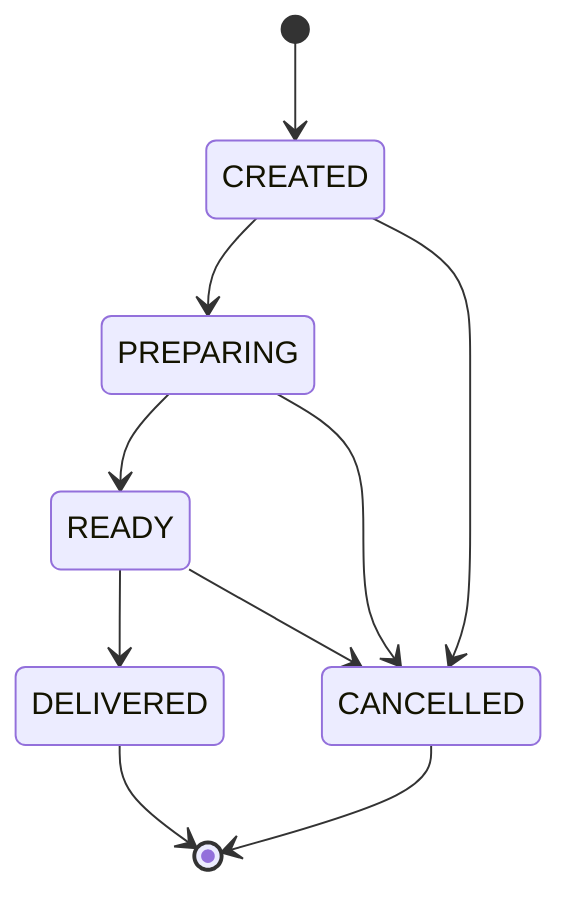
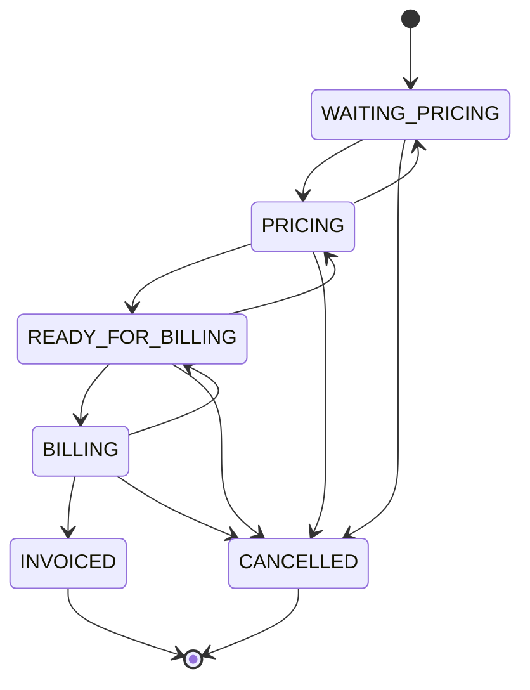

# Architecture

Sales Hub is deliberately small: the public version focuses on business workflow rather than infrastructure volume.

## Workflow boundaries

Two order channels share the same domain types but follow different state machines.

### Retail



### B2B



`src/domain/order-machine.ts` is the authority for these transitions. Screens call `transitionOrder`, which validates the requested move before updating the demo store.

## Demo data flow

```text
Totem / operational screen
          |
          v
     domain action
          |
          v
     demo-store.ts
       /       \
localStorage   BroadcastChannel
       \       /
        other open views
```

The browser store exists only to keep the public demo self-contained. A production version would replace this adapter with authenticated server-side persistence, authorization and audit controls while keeping the domain transition rules independent from the UI.

## Design constraints

- B2B price omission is intentional: commercial pricing happens after intent capture.
- Orders are transitioned rather than silently rewritten between workflow stages.
- Demo seed data is synthetic and separated from domain rules.
- Realtime notification is not treated as a source of truth.
- The public repository avoids production integrations and confidential business data.
